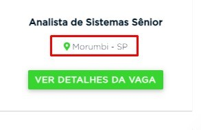

# *Bot* Extração de Dados Vagas Cadmus

Este arquivo explica as peculiaridades, funcionamentos e tarefas a serem executadas destes *bot*.

## INTRODUÇÃO

Este bot é encarregado de extrair três informações: nome das vagas, localidade e descrição do site da <b>CADMUS</b> e apos ser executado,
essas informações são salvas em planilhas e enviado para um respectivo email.

## ATIVIDADES QUE O BOT EXECUTA

Em sequência, aqui estão as atividades que o *bot* deve executar
### 1. Navegação do site
- O robo irá da um get na url https://cadmus.com.br/vagas-tecnologia/ e assim iniciando a nevagação direta na pagina de vagas.


### 2. Obter dados do site.   
- Irá analisar a pagina, caso tenha o botão cookie, aceitar, caso não, o bot segue em diante e assim irá identificar o nome das vagas, sua localidade e em seguinda irá clicar no botão da <b>descrição das vagas</b>
e assim o processo vai ocorrendo para cada respectivas vagas que estiver disponiveis.
    * Nome das vagas de onde deve extrair:
  
        
  
    * A localidade:
        
        
    
    * Clicar no botão Ver detalhes de vagas:
        
        
  
    * E apos extrair os dados da descrição:
        
        
        
### 3. Cria planilha Relatório 
- Gera uma planilha Excel formato xlsx que terá três colunas: Nome, vagas e descrição e nessas colunas ira conter as informações captadas
pelo bot.   

    

### 4. Salva na pasta do projeto   

- A planilha é salva na pasta do projeto `Planilha Relatorio`

### 5. Enviar por email o relatório 
- Apos finalizar os processos anteriores, o bot irá disparar um email para qual o usuário ira registrar suas informações no <b>[.config.yml](C:\Users\Edrielle\OneDrive\Documentos\python-robs\bot-relatorio-analitico\configs\.config.yml)</b>,

## PADRONIZAÇÃO

É **fundamental** para que o bot funcione corretamente:
1. Site esta funcionando ok
2.  E suas bibliotecas instaladas


## CONFIGURAÇÃO DE EXECUÇÃO - ARQUIVO.CONFIG.YAML

Toda interface com o usuário é feita através de um arquivo chamado `config.yml`.
Nele estão guardadas configurações de parametros que o programa utiliza.


* Nele você seta a data na qual o robô irá executar, caso deixe em branco vai ser a atual.
* Email de login e a senha na qual o robô ira disparar
* Email do destinatario. 

- Caso não deseje rodar o email ou a senha é só comentar e inserir outro, conforme exemplo a baixo.


## CONFIGURANDO O AMBIENTE

* Instale o Python na versão 3.8.3 - 64bits.
* Crie uma virtualenv.


### CRIANDO UMA VIRTUAL ENV

A versão do Python utilizada é a 3.8.3 — 64bits. Para saber a versão e a localização do Python na máquina, crie um 
arquivo `teste.py` contendo o código:

```python
from sys import path

print(path)
```

Conferido a versão do Python, crie uma virtual env e ative-a, para não haver conflito entre as versões das bibliotecas.

```shell
# Instala a maquina virtual
pip install virtualenv

# Nas versões mais recentes do python
# Diretório padrão do Python 3.8: C:/Users/rpa/AppData/Local/Programs/Python/Python38/python.exe
# Ex: virtualenv --python=C:/Users/rpa/AppData/Local/Programs/Python/Python38/python.exe diretorio/desejado/.venv
virtualenv --python=C:/diretório/da/versão/do/python/python.exe CUSTOM_ENV_NAME

# Ativa a virtual env
CUSTOM_ENV_NAME/Scripts/activate

#desativa a virtual env
deactivate

# Para buscar por comandos específico na virtual env
virtualenv -h
```

### INSTALAÇÃO DAS BIBLIOTECAS

Para a instalação das bibliotecas é só seguir o tutorial abaixo:

- No terminal do projeto, execute o: <b>pip install -r configs\requirements.txt</b>